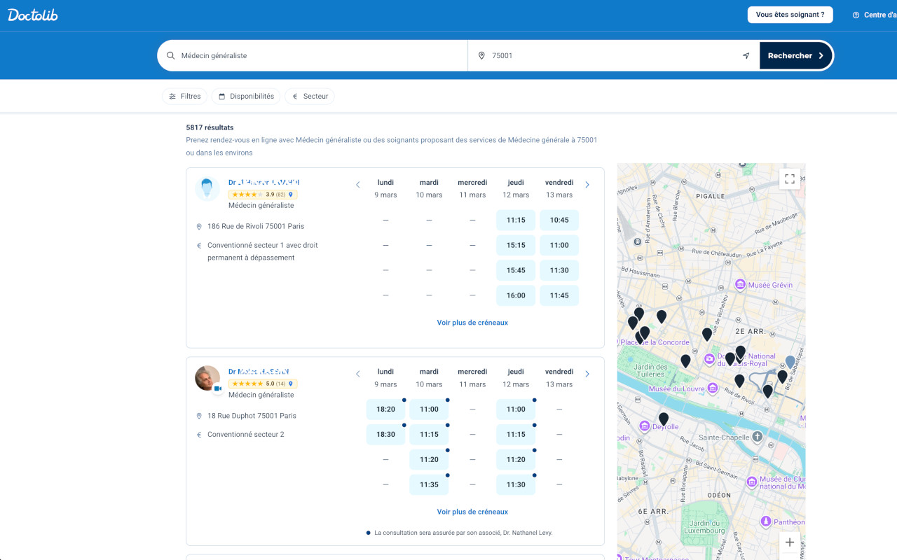
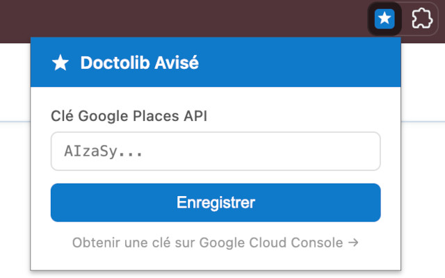

# Doctolib Avisé ⭐️

Extension Chrome qui affiche la note Google Maps de chaque praticien directement sur les pages de recherche Doctolib.

[](https://chromewebstore.google.com/detail/glhdnckepmnafedonhfdfedefahkldpl)



## Fonctionnement

Sur les pages de recherche Doctolib un badge s'affiche à droite du nom de chaque praticien avec :

- les étoiles ★ (sur 5)
- la note numérique
- le nombre d'avis entre parenthèses

Un clic sur le badge ouvre la fiche Google Maps du praticien. Si aucun résultat n'est trouvé, un badge "Non trouvé" s'affiche à la place.

## Installation

### 1. Prérequis — Clé API Google Places

L'extension utilise l'[API Places de Google](https://developers.google.com/maps/documentation/places/web-service/text-search) pour récupérer les notes.

1. Aller sur [Google Cloud Console](https://console.cloud.google.com/)
2. Créer un projet (ou en sélectionner un existant)
3. Activer l'**API Places** depuis la bibliothèque d'API
4. Dans **Identifiants**, créer une **Clé API**
5. Copier la clé générée

> **Coût** : Google offre 200 $/mois de crédit gratuit, ce qui couvre environ 2 000 recherches — largement suffisant pour un usage personnel.

### 2. Builder l'extension

```bash
npm install
npm run build
```

Cela génère le dossier `dist/` avec les fichiers minifiés.

### 3. Charger l'extension dans Chrome

1. Ouvrir `chrome://extensions`
2. Activer le **Mode développeur** (interrupteur en haut à droite)
3. Cliquer **Charger l'extension non empaquetée**
4. Sélectionner le dossier `dist/`

### 4. Configurer la clé API

Au premier lancement, cliquer sur l'icône **Doctolib Avisé** dans la barre d'outils Chrome, saisir la clé API et cliquer **Enregistrer**. La clé est stockée localement dans Chrome et n'est jamais transmise ailleurs.



## Structure

```
doctolib-avis/
├── src/
│   ├── background.js   — service worker source
│   ├── popup.js        — logique du popup source
│   ├── popup.html      — interface du popup
│   └── icons/
│       └── icon.svg    — icône source
├── dist/               — généré par npm run build (ne pas committer)
│   ├── background.js   — service worker minifié
│   ├── content.js      — script Doctolib minifié
│   ├── content.css
│   ├── popup.html
│   ├── popup.js        — popup minifié
│   └── icons/
│       ├── icon16.png
│       ├── icon48.png
│       └── icon128.png
├── content.js          — script injecté sur Doctolib
├── content.css         — styles des badges
├── manifest.json       — configuration de l'extension (Manifest V3)
├── build.js            — script de build (esbuild + sharp)
└── package.json
```

## Mise à jour

Après toute modification des fichiers source, relancer le build puis recharger l'extension :

```bash
npm run build
```

Sur `chrome://extensions`, cliquer l'icône de rechargement de l'extension.

Pour rebuild automatiquement à chaque changement :

```bash
npm run watch
```

## Licence

MIT © [Lucas Pantanella](https://github.com/naei)
